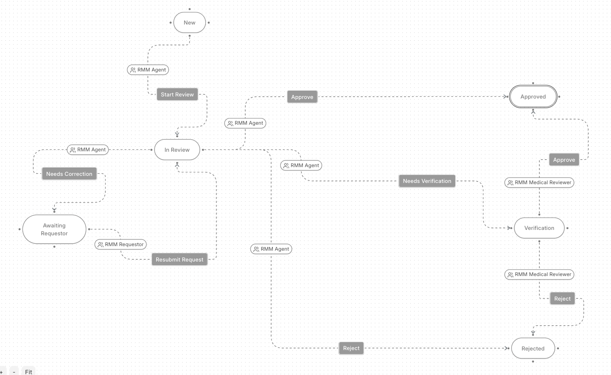

# Request Management Module (RMM)

A Frappe v16 app implementing a **Compassionate Use Request** workflow — enabling external physicians to submit requests for unapproved medicinal products, which an internal pharma review team then evaluates and decides on.

---

## Bench & Python Version

| Requirement | Version |
|---|---|
| Frappe | v16 |
| Python | 3.14 |

---

## Installation

```bash
bench get-app https://github.com/tahamshahzad/screening_test_normivo
bench --site <site> install-app rmm
bench --site <site> migrate
```

`bench migrate` imports the bundled fixtures (roles, workflow, workflow states, workflow actions, and seed users) automatically. No additional seed command is needed.

> **Note on seed user passwords:** Frappe does not export password hashes in fixtures. Seed user accounts will be created on install but will need passwords set via the "Forgot Password" flow or `bench --site <site> set-user-password <email>`.

---

## Story 1 — Creating a Request

### Fields chosen

| Section | Field | Type | Rationale |
|---|---|---|---|
| **Requester** | `requester_name` | Data | Identifies the submitting physician |
| | `medical_license_number` | Data | Verifies the requester is a licensed practitioner |
| | `speciality` | Select | Contextualises the clinical framing of the request |
| | `institution_name` | Data | Establishes the requesting organisation |
| | `institution_type` | Select | Distinguishes university hospitals from clinics — relevant for ethics review |
| | `requester_email` | Data | Communication channel for follow-up |
| **Patient** | `patient_code` | Data | Anonymises the patient while allowing tracking |
| | `patient_initials` | Data | Secondary de-identification reference |
| | `patient_year_of_birth` | Int | Age range without exposing exact DOB |
| | `sex` | Select | Clinically relevant; required for pregnancy flag logic |
| | `indication_code` | Data | ICD or similar code for the condition |
| | `indication_description` | Text Editor | Free-text clinical description |
| **Clinical Request** | `requested_product` | Data | The unapproved product being requested |
| | `requested_dose` | Data | Dose and regimen |
| | `treatment_duration` | Data | Intended duration |
| | `clinical_justification` | Text Editor | Why this product; why now |
| | `prior_treatments` | Text Editor | What has already been tried — key for the "no approved alternative" criterion |
| **Clinical Criteria** | `is_off_label` | Check | Flags unapproved use of an approved product |
| | `is_pediatric` | Check | Flags paediatric patient; heightened scrutiny |
| | `is_pregnancy` | Check | Triggers mandatory medical verification before approval |
| | `requires_verification` | Check (read-only) | Auto-set from `is_pregnancy`; drives the verification guard |
| **Decision** | `decision_date` | Datetime | Stamped when a decision is reached |
| | `decision_rationale` | Text Editor | Reviewers document the basis for approval or rejection |
| | `bfarm_program_number` | Data | Reference to the relevant regulatory programme (BfArM) |
| **System** | `received_on` | Date (read-only) | Auto-stamped on creation via `before_save`; audit anchor for when the request came in |
| | `naming_series` | Select | Auto-generates `CUR-YYYY-####` document IDs |

### Why these fields

The field set models three distinct parties in the compassionate use process:

1. **Patient (third party)** — identified by anonymised code and initials rather than a name, with year of birth and sex giving reviewers enough clinical context without storing unnecessary personal data.
2. **Requestor (external physician)** — name, licence number, specialty, and institution tell the review team who is asking and whether they are qualified. The requestor is not a system user; the form is their point of entry.
3. **Review team (internal)** — the clinical criteria flags (off-label, paediatric, pregnancy) are checkboxes the doctor fills in that signal cases needing closer review. The decision section is written by the review team after their decision is made.

`prior_treatments` is required because "no approved alternative exists" is the primary qualifying criterion for compassionate use. `indication_code + indication_description` lets reviewers cross-reference a standardised code while still reading a plain-language explanation.

**Who is internally responsible:** Responsibility is tracked via Frappe's native assignment mechanism (`_assign` field). The Team Lead assigns a request to an agent using the built-in Assign button. The assigned agent's email is stored on the record and is used by both the permission filter and the workflow to identify who is responsible.

**A note on field completeness:** This field set is a best-effort approximation based on the domain description. I am not a domain expert in pharmaceutical regulation. Given a proper clinical or regulatory brief, the fields would be revised to match the exact requirements of the applicable programme (e.g. BfArM §21 AMG in Germany).

### Field-level access (permlevels)

Frappe's `permlevel` system assigns a numeric level to each field and a matching level to each role's permission row. A role can only read or write fields at or below its permitted level.

| Permlevel | Fields | Who can write |
|---|---|---|
| **3** | All doctor-facing fields (requester, patient, clinical request, clinical criteria) | RMM Requestor |
| **4** | Decision fields (decision date, rationale, BfArM number) | RMM Agent, RMM Medical Reviewer |
| **1** | Naming series, `requires_verification` (read-only) | System / auto-set |

The doctor can read the decision fields once filled in, but cannot edit them. The review team can read everything the doctor entered but cannot modify it after submission. This is enforced at the model level by Frappe — no custom code is needed.

### Roles and visibility

| Role | Create | Read | Write |
|---|---|---|---|
| **RMM Requestor** | Yes — own requests only | Own requests only | Doctor-facing fields (permlevel 3) |
| **RMM Team Lead** | No | All requests | All requests; assigns agents |
| **RMM Agent** | No | Requests assigned to them | All fields including decision (permlevel 4) |
| **RMM Medical Reviewer** | No | Requests in Verification, Approved, Rejected (plus any assigned to them) | Decision fields (permlevel 4) |

**How visibility is enforced:**

- **RMM Requestor** — Frappe's built-in `if_owner` flag on the DocType permission row restricts them to records they created. No custom code needed.
- **RMM Team Lead** — the `permission_query_conditions` hook returns no SQL condition for this role, so they see all records.
- **RMM Agent** — the hook restricts them to records where their email appears in the `_assign` field. They only see what has been assigned to them.
- **RMM Medical Reviewer** — the hook adds `workflow_state IN ('Verification', 'Approved', 'Rejected')` so they only see records that have reached those states. If a record is explicitly assigned to them, they can also see it regardless of state.

Both a list-view SQL filter hook (`permission_query_conditions`) and a document-level access hook (`has_permission`) are registered in `hooks.py` to enforce these rules consistently whether a user is browsing the list or opening a record directly.

---

## Story 2 — Processing a Request Through Internal Review

### States and transitions



| From | Action | To | Role |
|---|---|---|---|
| New | Start Review | In Review | RMM Agent |
| In Review | Needs Verification | Verification | RMM Agent |
| In Review | Needs Correction | Awaiting Requestor | RMM Agent |
| In Review | Approve | Approved | RMM Agent |
| In Review | Reject | Rejected | RMM Agent |
| Awaiting Requestor | Resubmit Request | In Review | RMM Requestor |
| Verification | Approve | Approved | RMM Medical Reviewer |
| Verification | Reject | Rejected | RMM Medical Reviewer |

### How the workflow works

A request starts in **New** when the doctor submits it. The Team Lead assigns it to an agent, who moves it to **In Review**. From there the agent has four options:

- **Approve or Reject** directly — used when the request does not require medical verification.
- **Needs Verification** — escalates to a Medical Reviewer. Only the Medical Reviewer can then Approve or Reject from the **Verification** state.
- **Needs Correction** — sends the request back to the doctor. It enters **Awaiting Requestor**. The doctor can update it and resubmit, which returns it to **In Review** only — it cannot skip ahead to any other state.

### Decision: Workflow Action transitions, not custom code

All transitions — including the send-back loop — are implemented as Workflow Action transitions inside Frappe's Workflow engine, with each action restricted to the correct role. This means:

- Only the assigned agent can take the "Needs Correction" action (RMM Agent role required).
- "Awaiting Requestor" can only transition to "In Review" via "Resubmit Request" (RMM Requestor role required) — there is no transition from that state to anywhere else, so skipping ahead is impossible by construction.
- No `frappe.db.set_value` or manual state manipulation is used anywhere. Frappe's workflow engine enforces every transition rule, and every state change is automatically logged with the user and timestamp via Frappe's built-in workflow action log.

### Decision: Verification approach

**I chose approach (a) — a boolean flag gates whether Verification is required — implemented as a hybrid with the state always present in the workflow graph.**

The Verification state is always in the workflow definition. Whether a request is required to pass through it is controlled by `requires_verification`, which is auto-set from `is_pregnancy` in `before_save`. This means:

- For requests that do not require verification, the agent can Approve or Reject directly from In Review. The Verification state exists but is never entered.
- For requests that do require verification, the agent must use "Needs Verification" to escalate. The `validate()` method then blocks any attempt to Approve or Reject unless the previous committed state in the database was "Verification".

I chose this over a pure approach (b) (auto-skip) because Frappe's Workflow engine does not support conditional auto-skipping of states natively. Implementing auto-skip would require a custom `before_workflow_action` hook to intercept transitions and re-route them — more custom code than using the boolean flag. The flag approach is simpler, explicit, and testable.

**Two layers of enforcement so the rule cannot be bypassed:**

1. **UI layer** — each transition is tied to a specific role, so an agent on a pregnancy request will not be shown the direct Approve/Reject buttons; only "Needs Verification" is available as an escalation path.

2. **Backend guard** — even if someone calls the API directly and forces the state to Approved or Rejected, `validate()` rejects the save:

```python
def validate(self) -> None:
    if (
        self.workflow_state in ("Approved", "Rejected")
        and self.requires_verification
        and (self.get_db_value("workflow_state") or "New") != "Verification"
    ):
        frappe.throw(
            "This request requires medical verification before it can be approved or rejected."
        )
```

`get_db_value("workflow_state")` reads the last committed state from the database, so the guard only fires when Verification was skipped. Once a request has legitimately passed through Verification, the guard allows the final decision.

---

## Story 3 — Managing the Queue

**Status: delivered via Frappe core — no custom code needed.**

Frappe's built-in list view already provides what Story 3 requires. Agents can:

- See all requests assigned to them (enforced by the `permission_query_conditions` hook — unassigned requests are invisible to agents automatically).
- Filter by `workflow_state`, `received_on`, `requested_product`, or any other field using the standard list view filter bar.
- Sort by date received or status to prioritise work.
- Save named filters as private views for personal use.

No custom queue view was built because the native list view with the permission filter already delivers the outcome: each agent sees only their own open requests and can sort and filter them as needed. Building a custom page would duplicate this for no additional user value within the scope of this task.

---

## Story 4 — Workload Overview

**Status: skipped — deliverable via a Frappe Script Report with no custom DocType code required.**

A Team Lead workload view (requests per agent, broken down by status) can be built as a Frappe **Script Report** on the `Compassionate Use Request` DocType. The report queries `_assign`, `workflow_state`, and `modified` and groups results by assignee and state. This is entirely configuration within the Frappe report builder — no Python controller changes are needed.

This was skipped because the task prioritised Stories 1 and 2, and building the report would not have demonstrated anything beyond Story 3's approach (it is the same Frappe pattern). In a real sprint this would be the next task.

---

## Stories Completed / Skipped

| Story | Status | Notes |
|---|---|---|
| Story 1 — Creating a request | Complete | DocType with full field set, `received_on` auto-stamp, assignment via native Frappe `_assign`, role-based access with permlevels |
| Story 2 — Processing through review | Complete | Six states, eight role-restricted transitions via Workflow engine; send-back loop enforced by transition rules; Verification gated by boolean flag + `validate()` guard |
| Story 3 — Managing the queue | Complete via Frappe core | Native list view + `permission_query_conditions` hook delivers per-agent filtered queue with sorting and filtering out of the box |
| Story 4 — Workload overview | Skipped | Achievable as a Frappe Script Report (no DocType changes needed); deprioritised in favour of completing Stories 1–2 fully |

---

## How to Extend

### 1. SLA Timers Per Status

- Add a `sla_deadline` Datetime field (read-only, high permlevel) and a configuration doctype (`RMM SLA Config`) mapping each workflow state to a number of business hours.
- Hook `doc_events → on_update` to stamp `sla_deadline = now + configured_hours` whenever `workflow_state` changes.
- A scheduled task (`scheduler_events`, hourly) queries records where `sla_deadline < now` and the state is still open, then sends alerts via `frappe.sendmail` and sets an `sla_breached` flag.
- The list view can colour-code breached records using a `doctype_list_js` client-side renderer checking `sla_breached`.
- No external dependency required — all within Frappe's scheduler and email infrastructure.

### 2. Bulk Reassignment by Team Leads

- Add a list-view action (registered in `doctype_list_js`) that appears only for the `RMM Team Lead` role, opening a dialog to select a new assignee.
- On submit, call a whitelisted server method that iterates the selected document names, removes the existing `_assign` entry via `frappe.utils.assign_to`, and adds the new assignee.
- The same method sends a single batch notification to the new assignee rather than one email per record.
- Gate the whitelisted method with `frappe.only_for("RMM Team Lead")` to prevent role escalation.
- No schema changes needed — `_assign` is a native Frappe field on every DocType.

### 3. Audit Export for Compliance

- `track_changes = 1` is already enabled on the DocType, so Frappe's `Version` log captures every field change with timestamp and user.
- Add a Script Report that joins `Compassionate Use Request` with `Version` to produce a chronological audit trail per request: who changed what, when, and from which workflow state.
- Export the report to XLSX via Frappe's built-in report export; for automated delivery add a scheduled task that generates and emails the report to a compliance mailbox on a configurable cadence.
- Sensitive fields (patient data at permlevel 3) can be redacted in the export query using `frappe.has_permission` checks per row, ensuring the export respects the same access model as the UI.
- For long-term retention, write each export to a Frappe `File` record so every export is archived and traceable.

---

## Running Tests

```bash
bench --site <site> run-tests --app rmm
# or target the specific doctype:
bench --site <site> run-tests --doctype "Compassionate Use Request"
```

Tests are in `rmm/request_management_module/doctype/compassionate_use_request/test_compassionate_use_request.py` and cover:

- **Group 1 — Before Save**: `received_on` auto-stamp, `requires_verification` derivation from `is_pregnancy`, initial workflow state.
- **Group 2 — List Filter**: Each role's `permission_query_conditions` output — confirms agents see only assigned records, medical reviewers see only allowed states, team leads see everything.
- **Group 3 — Document Access**: `has_permission` for each role and workflow state combination.
- **Group 4 — Workflow Guard**: Transitions applied via `apply_workflow` (not `db.set_value`); confirms the guard blocks direct Approve/Reject when verification is required and allows it after passing through Verification.

---

## Time Log

| Story | Approx. time |
|---|---|
| Story 1 — Field set, DocType, roles, and permissions | 3 h |
| Story 2 — Workflow setup, verification guard | 3 h |
| Story 3 — Queue (Frappe core; permission filter) | included in Story 1 |
| Story 4 — Workload overview | skipped |
| Tests, type hints, mypy/Pyright config | 2 h |
| **Total** | **8 h** |

Time includes reading Frappe v16 documentation, debugging workflow action names, and resolving type-checker configuration for Frappe's untyped internals.

---

## License

MIT
